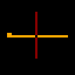

Wired Logic
===========

Wired Logic can turn a still image like this…

…into an animation like that…

How to run it?
--------------

    go run $GOPATH/src/github.com/martinkirsche/wired-logic/apps/gif/main.go input.gif output.gif
    
How does it work?
-----------------

It scans the image, converts it into a collection of wires, power sources and
transistors and runs a simulation on them as long as the state of the 
simulation does not recur. Then it renders the simulation into the animated
gif image.

### The rules

Description | Example  
------------|--------
Wires are all pixels of the color from index 1 to 7 within the palette. |  
A 2x2 pixel square within a wire will make the wire a power source. | 
Wires can cross each other by poking a hole in the middle of their crossing. | 
A transistor gets created by drawing an arbitrarily rotated T-shape and, you guessed it, poking a hole in the middle of their crossing. If a transistor's base gets charged it will stop current from flowing. If not, current will flow but gets reduced by one. | 